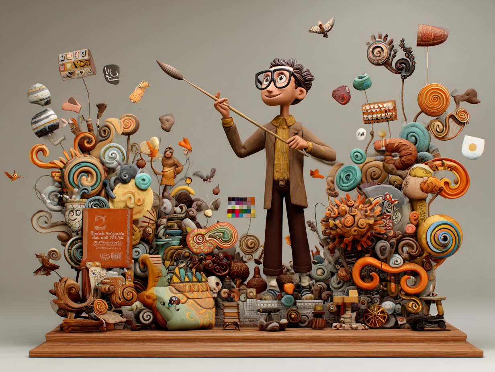
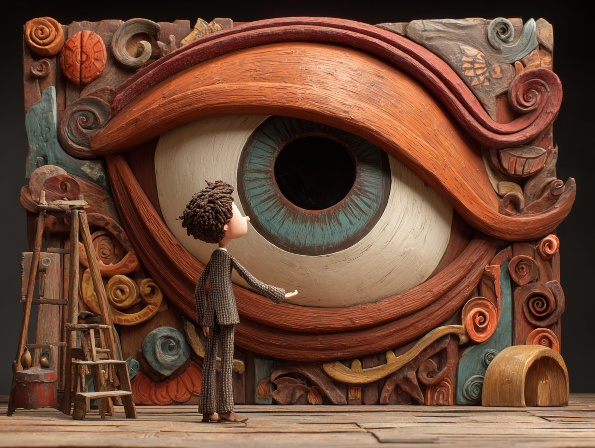

# Part 4: Introduction to Branding Frameworks

## What You'll Learn in Weeks 7-8
 
In the second half of the course, you'll develop your personal or startup brand using professional branding frameworks. Here's a preview of what's coming:
 
**Week 7: Brand Strategy**
You'll learn frameworks for defining:
- Mission, vision, values
- Unique value proposition (UVP)
- Brand positioning and differentiation
- **Jungian archetypes for brand personality** (one framework among several)
- Competitive analysis
 
**Week 8: Brand Identity**
You'll apply your strategy to create:
- Visual identity (logo, colors, typography)
- Brand guidelines
- Website wireframes
- Consistent brand expression

**Why We're Mentioning This Now**:
 
You don't need to master branding frameworks yet, but awareness helps because:
- Some Madison projects involve brand analysis (voice checking, consistency scoring)
- Understanding brand strategy makes you a better marketing technologist
- When you pitch your Madison tool, you'll use branding concepts
 
**Quick Overview: Jungian Brand Archetypes**
 
*Note: This is just awareness-building. You'll do a deep dive in Week 7.*
 
Carl Jung identified 12 universal personality patterns. Brands use these as frameworks for consistent personality. Examples:
- **Nike** = The Hero (achievement, challenge)
- **Apple** = The Magician (transformation, innovation)
- **Patagonia** = The Explorer (freedom, authenticity)
- **Google** = The Sage (knowledge, wisdom)

In Week 7, you'll choose an archetype for YOUR brand (personal or startup) to guide all your messaging and visual decisions. Some students also build Madison tools that detect or analyze brand archetypes, but that's optional.

**For now**: Just be aware this framework exists. You'll use it later for positioning yourself or your Madison startup.

---

| [← Part 3: Madison Framework Project Selection](./3_Madison_Framework_Project_Selection.md) | &nbsp;&nbsp;&nbsp;&nbsp;&nbsp;&nbsp;&nbsp;&nbsp;&nbsp;&nbsp;&nbsp;&nbsp;&nbsp;&nbsp;&nbsp;&nbsp;&nbsp;&nbsp;&nbsp;&nbsp;&nbsp;&nbsp;&nbsp;&nbsp;&nbsp;&nbsp;&nbsp;&nbsp;&nbsp;&nbsp;&nbsp;&nbsp;&nbsp;&nbsp;&nbsp;&nbsp;&nbsp;&nbsp;&nbsp;&nbsp;&nbsp;&nbsp;&nbsp;&nbsp;&nbsp;&nbsp;&nbsp;&nbsp;&nbsp;&nbsp;&nbsp;&nbsp;&nbsp;&nbsp;&nbsp;&nbsp;&nbsp;&nbsp;&nbsp;&nbsp; | [Part 5: Personal Brand Baseline →](./5_Personal_Brand_Baseline.md) |
|:---|:---:|---:|