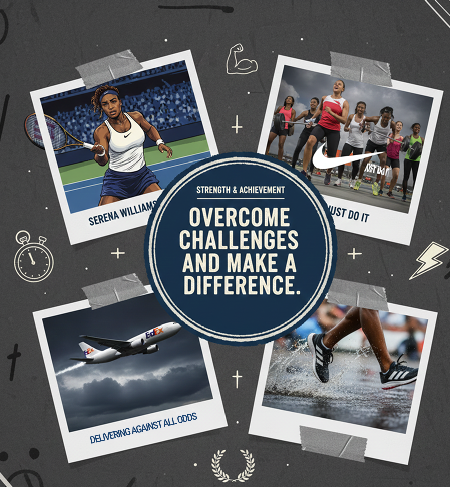
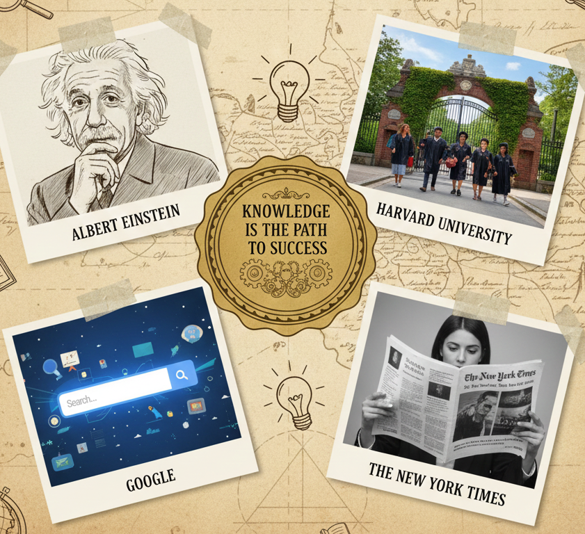
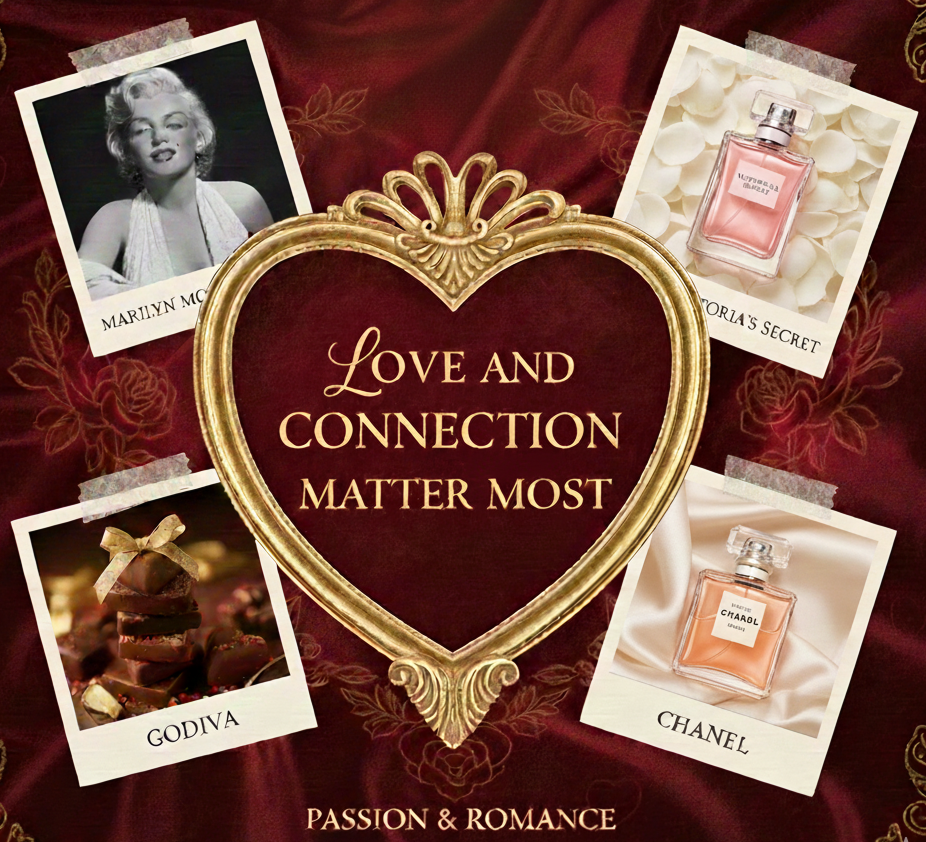
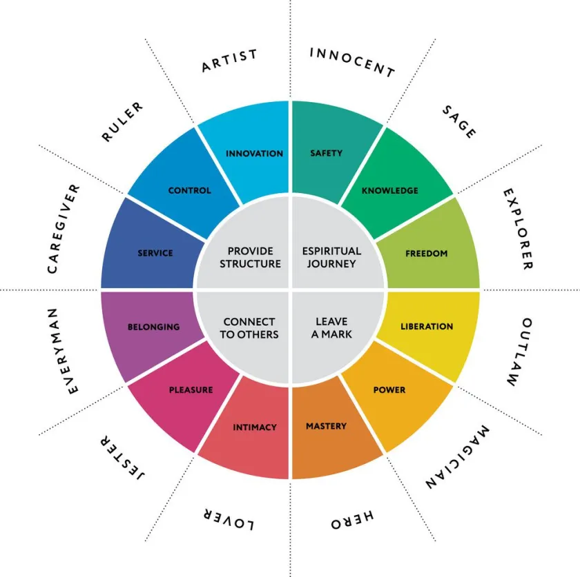
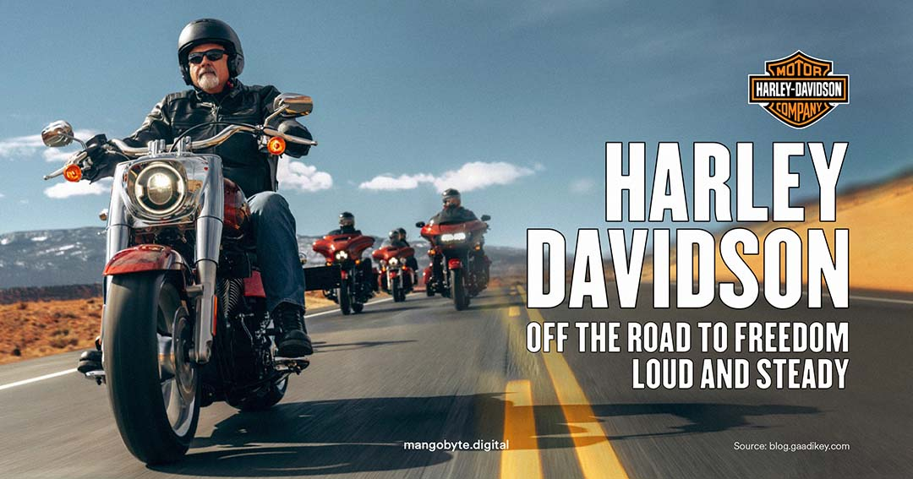

# Week 1: Brand Archetypes — The Foundation

## Welcome to the Psychology of Branding


Have you ever wondered why some brands just *feel* right? Why Nike makes you want to lace up your sneakers and conquer the world, while Coca-Cola wraps you in a warm blanket of nostalgia and happiness? The answer lies not in marketing tricks, but in something much deeper, something that's been wired into human psychology for thousands of years.

Welcome to the world of brand archetypes, where ancient wisdom meets modern branding.

---

## The Origin Story: Carl Jung and the Collective Unconscious


Let's rewind to early 20th century Switzerland. A brilliant psychologist named Carl Jung had a fascinating observation: across different cultures, separated by oceans and centuries, humans told remarkably similar stories. The heroes, the wise mentors, the rebels, they all appeared again and again, wearing different costumes but playing the same essential roles.

Think about it:
- **Hercules** (Ancient Greece) and **Superman** (Modern America): both heroes overcoming impossible odds
- **Merlin** (Arthurian Legend) and **Yoda** (Star Wars): both wise sages guiding the young
- **Robin Hood** (Medieval England) and **The Joker** (Contemporary Fiction): both rebellious outlaws challenging the system

Jung called these recurring patterns **archetypes**, and he believed they existed in our *collective unconscious*, a shared psychological inheritance that shapes how we perceive the world and connect with narratives. These weren't just random story elements; they represented fundamental human motivations, fears, and desires.

### Why Do Archetypes Work?

Archetypes resonate because they reflect deep psychological needs. When we encounter an archetypal character or brand, it triggers something primal in us. We don't just *recognize* the archetype, we *feel* it. It's familiar, like meeting an old friend we've never actually met before.


This is why storytelling is so powerful. And in the modern world, brands have learned to harness this same psychological force.

---

## From Psychology to Branding: The Connection

Here's where it gets interesting for us as brand builders: **brands are essentially characters in stories**. Just as a hero in a movie has personality traits, motivations, and a voice, so does every successful brand.

When a brand aligns with an archetype, it taps into those same deep psychological patterns to make their brand hold meaning to their customers. It helps the brand:

1. **Create instant recognition**: You immediately "get" what the brand stands for (Disney = Magic, Harley-Davidson = Freedom)
2. **Build emotional connections**: The archetype speaks to subconscious associations and desires
3. **Establish trust**: The brand follows a narrative structure that feels authentic and familiar

Think of it this way: brands don't just *sell* products. The truly memorable ones embody an archetypal identity that resonates with customers on a psychological level. They tell a story. They invite you to be part of something bigger.

---

## The 12 Branding Archetypes: Your Cast of Characters

Jung's psychological insights inspired what we now call the **12 branding archetypes**. Each represents a distinct personality, set of values, and way of connecting with the world. Let's meet them.

### The Stability & Belonging Cluster

#### 1. **The Innocent**: "Happiness & Simplicity"

**Core Message:** "Life is simple and good."

**Personality:** Pure, optimistic, wholesome. The Innocent sees the glass as half full and believes in the goodness of people.


**Real-World Examples:**
- **Coca-Cola**: Happiness in a bottle. Their branding consistently evokes nostalgia, simple pleasures, and togetherness.
- **Dove**: Celebrates natural beauty and authenticity
- **Aveeno**: Pure, simple, gentle skincare

**Notable Person:** Fred Rogers (Mister Rogers): His genuine kindness, gentle demeanor, and unwavering optimism made him the embodiment of the Innocent archetype.

**When to Use This Archetype:** If your brand promises simplicity, purity, honesty, or nostalgia. Perfect for products/services that aim to make life easier or bring back simple joys.

---

#### 2. **The Everyman**: "Relatable & Approachable"

**Core Message:** "We belong together."

**Personality:** Friendly, humble, down-to-earth. The Everyman is your neighbor, your buddy, someone you can relate to without pretense.


**Real-World Examples:**
- **IKEA**: Affordable furniture for everyone, democratic design
- **Levi's**: Classic jeans for regular folks
- **eBay**: A marketplace by the people, for the people

**Notable Person:** Tom Hanks: Warm, approachable, relatable. He plays characters we can all see ourselves in.

**When to Use This Archetype:** If your brand values inclusivity, accessibility, and community. Great for brands that want to be seen as "one of us" rather than elite.

---

#### 3. **The Caregiver**: "Compassion & Nurturing"

**Core Message:** "Helping others is what matters."

**Personality:** Generous, supportive, selfless. The Caregiver puts others first and finds fulfillment in service.


**Real-World Examples:**
- **Johnson & Johnson**: "A Family Company" caring for families
- **TOMS**: One for One model, giving back with every purchase
- **UNICEF**: Protecting and nurturing children worldwide

**Notable Person:** Mother Teresa: Her lifelong dedication to caring for the poor and sick epitomizes the Caregiver.

**When to Use This Archetype:** Perfect for healthcare, nonprofits, and any brand centered on service, support, and nurturing others.

---

### The Change & Risk Cluster

#### 4. **The Hero** — "Strength & Achievement"

**Core Message:** "Overcome challenges and make a difference."

**Personality:** Courageous, determined, inspiring. The Hero rises to challenges and pushes boundaries.



**Real-World Examples:**
- **Nike**: "Just Do It" Pushing athletes to achieve greatness
- **Adidas**: Performance and victory
- **FedEx**: Delivering against all odds ("When it absolutely, positively has to be there overnight")

**Notable Person:** Serena Williams: Determination, resilience, breaking barriers, and inspirational achievements.

**When to Use This Archetype:** If your brand is about empowerment, achievement, solving problems, or making a positive impact. Great for sports, fitness, and mission-driven organizations.

---

#### 5. **The Outlaw (Rebel)**: "Breaking the Rules"

**Core Message:** "Rules are made to be broken."

**Personality:** Bold, disruptive, rebellious. The Outlaw challenges the status quo and doesn't apologize for it.


**Real-World Examples:**
- **Harley-Davidson**: Freedom, rebellion, the open road
- **Tesla**: Disrupting the auto industry, challenging Big Oil
- **Diesel**: Edgy fashion that rejects convention

**Notable Person:** Elon Musk: A disruptor in tech and transportation, courting controversy and breaking norms.

**When to Use This Archetype:** If your brand challenges conventions, disrupts industries, or targets people who see themselves as non-conformists.

---

#### 6. **The Magician**: "Transformation & Wonder"

**Core Message:** "Anything is possible."

**Personality:** Visionary, charismatic, mystical. The Magician makes dreams come true and transforms the ordinary into extraordinary.


**Real-World Examples:**
- **Disney**: Where dreams come true and magic happens
- **Apple**: Technology that feels like magic
- **TED Talks**: Ideas worth spreading, transforming perspectives

**Notable Person:** Tony Robbins: Known for transformative seminars and inspiring life-changing shifts in people.

**When to Use This Archetype:** If your brand creates transformative experiences, innovative solutions, or moments of wonder.

---

#### 7. **The Explorer**: "Freedom & Discovery"

**Core Message:** "Adventure is out there."

**Personality:** Curious, independent, adventurous. The Explorer seeks new experiences and uncharted territories.


**Real-World Examples:**
- **Jeep**: Go anywhere, explore everything
- **The North Face**: Never stop exploring
- **Patagonia**: Adventure with a conscience

**Notable Person:** Jacques Cousteau: Ocean explorer and conservationist who expanded our understanding of the deep sea.

**When to Use This Archetype:** If your brand is about adventure, discovery, independence, or breaking free from constraints.

---

### The Ego & Mastery Cluster

#### 8. **The Sage**: "Wisdom & Truth"

**Core Message:** "Knowledge is the path to success."

**Personality:** Thoughtful, intelligent, insightful. The Sage values truth, knowledge, and understanding above all.



**Real-World Examples:**
- **Google**: Organizing the world's information
- **Northeastern University** / **Harvard**: Institutions of higher learning
- **The New York Times**: "All the News That's Fit to Print"

**Notable Person:** Albert Einstein: Profound insights and intellectual curiosity exemplifying the pursuit of wisdom.

**When to Use This Archetype:** If your brand is about education, information, research, or helping people make informed decisions.

---

#### 9. **The Ruler**: "Authority & Control"

**Core Message:** "Power and success through structure."

**Personality:** Confident, commanding, refined. The Ruler values order, leadership, and excellence.


**Real-World Examples:**
- **Rolex**: Luxury, precision, status
- **Mercedes-Benz**: Engineering excellence and prestige
- **Microsoft**: Industry leadership and professional power

**Notable Person:** Queen Elizabeth II: Long-reigning figure of authority, tradition, and dignified leadership.

**When to Use This Archetype:** If your brand represents premium quality, leadership, or exclusive status.

---

### The Innovation & Enjoyment Cluster

#### 10. **The Creator**: "Innovation & Imagination"

**Core Message:** "Creativity brings new possibilities."

**Personality:** Expressive, visionary, artistic. The Creator builds, designs, and innovates.


**Real-World Examples:**
- **Apple**: Think Different, design-forward innovation
- **Adobe**: Empowering creators worldwide
- **LEGO**: Building imagination brick by brick

**Notable Person:** Walt Disney: Revolutionized animation and theme parks through boundless creativity.

**When to Use This Archetype:** If your brand is about self-expression, innovation, design, or giving people tools to create.

---

#### 11. **The Lover**: "Passion & Romance"

**Core Message:** "Love and connection matter most."

**Personality:** Sensual, intimate, warm. The Lover is about beauty, relationships, and emotional experiences.



**Real-World Examples:**
- **Victoria's Secret**: Sensuality and confidence
- **Godiva**: Indulgent chocolate experiences
- **Chanel**: Elegance, beauty, allure

**Notable Person:** Marilyn Monroe: Iconic charm, romantic allure, and passion.

**When to Use This Archetype:** If your brand is about beauty, intimacy, passion, or creating emotional connections.

---

#### 12. **The Jester**: "Fun & Playfulness"

**Core Message:** "Life's too short to be serious all the time."

**Personality:** Lighthearted, humorous, entertaining. The Jester brings joy and reminds us not to take things too seriously.


**Real-World Examples:**
- **M&M's**: Fun, colorful, playful candy
- **Old Spice**: Absurdist humor in advertising
- **Skittles**: "Taste the Rainbow" with quirky campaigns

**Notable Person:** Steve Martin: Comedic genius, quick wit, and playful energy.

**When to Use This Archetype:** If your brand brings joy, humor, or playful moments to people's lives.

---

## Why This Matters for Your Branding Work

As you build brands (whether for organizations, causes, or yourself), understanding archetypes gives you a powerful framework:

### 1. **Clarity of Identity**
Instead of a vague "we're friendly and innovative and trustworthy and..." you have a clear personality. You can't be all archetypes. Choose one.

### 2. **Consistency Across Touchpoints**
When you know your archetype, every decision becomes easier:
- What tone should this social media post have?
- What colors align with our brand?
- How should we respond to this crisis?

Your archetype is your North Star.

### 3. **Emotional Resonance**
Archetypes don't just communicate *what* you do, they communicate *why it matters*. They create emotional connections that transcend features and benefits.

### 4. **Authentic Storytelling**
When your brand has a clear archetype, storytelling becomes natural. You're not making things up; you're expressing your archetypal identity through narrative.



---

## Applying Archetypes: A Practical Framework

### Step 1: Identify Your Brand's Archetype

Ask yourself (or your organization):

1. **What's the core personality?** (Bold & rebellious? Nurturing & supportive? Wise & educational?)
2. **How do you communicate?** (Do you inspire? Teach? Entertain? Challenge?)
3. **What emotional response do you want to create?** (Trust? Excitement? Wonder? Belonging?)
4. **What's the fundamental motivation or need you address?** (Safety? Achievement? Knowledge? Freedom?)


### Step 2: Align Your Storytelling

Shape your brand narrative based on your archetype:

- **Hero** (Nike, Malala Yousafzai): Share stories of overcoming challenges, resilience in adversity
- **Sage** (TED Talks, Neil deGrasse Tyson): Provide wisdom, insights, educational content
- **Caregiver** (UNICEF, Johnson & Johnson): Highlight support, protection, nurturing impact
- **Outlaw** (Tesla, Greenpeace): Challenge conventions, disrupt the status quo

### Step 3: Express It Across All Touchpoints

Your archetype should be visible in:

#### **Visual Identity**
- **Colors:** Blue for trust (Sage, Caregiver), Red for urgency/passion (Hero, Lover), Black for sophistication (Ruler, Outlaw)
- **Typography:** Clean and modern (Creator), Classic and refined (Ruler), Playful and rounded (Jester)
- **Imagery:** What kinds of photos, illustrations, or graphics align with your archetype?

#### **Voice & Tone**
- **Hero:** Inspiring, empowering, confident ("You can do this!")
- **Sage:** Thoughtful, informative, authoritative ("Here's what you need to know...")
- **Jester:** Playful, witty, fun ("Let's not take ourselves too seriously!")
- **Caregiver:** Warm, supportive, reassuring ("We're here for you.")

#### **Content Strategy**
- **Social Media:** What would your archetype post about? How would they engage?
- **Website Copy:** What language resonates with your archetype?
- **Campaign Messaging:** How does your archetype show up in campaigns?

### Step 4: Stay Consistent

Brand confusion happens when you're inconsistent. One day you're The Hero inspiring people to action, the next day you're The Jester making jokes. Pick your lane and stay in it.

This doesn't mean you can't be multifaceted—but you should have a *primary* archetype with perhaps one complementary *secondary* archetype.

**Example:** Apple is primarily **The Creator** (innovation, design, empowering creativity) with a touch of **The Magician** (making technology feel magical and transformative).

---

## Real-World Brand Examples: Deconstructed

### Nike (The Hero)


**What They Do:** Sell athletic apparel and shoes

**How They Brand:** Inspire people to overcome their limitations and achieve greatness

**Archetype in Action:**
- **Messaging:** "Just Do It" — A call to heroic action
- **Storytelling:** Ads feature athletes overcoming adversity, pushing boundaries
- **Emotional Hook:** You're not buying shoes; you're buying into the belief that you can be a hero in your own story

---

### Google (The Sage)


**What They Do:** Provide search, information, and technology services

**How They Brand:** Organize the world's information and make it universally accessible

**Archetype in Action:**
- **Messaging:** "Don't be evil" (original), emphasis on truth and knowledge
- **Storytelling:** Focus on discovery, learning, and empowering people with information
- **Emotional Hook:** Google helps you become smarter and more informed

---

### Harley-Davidson (The Outlaw)



**What They Do:** Manufacture motorcycles

**How They Brand:** Represent freedom, rebellion, and individuality

**Archetype in Action:**
- **Messaging:** "American by Birth. Rebel by Choice."
- **Storytelling:** The open road, breaking free from conformity, living on your terms
- **Emotional Hook:** You're not buying a motorcycle; you're buying freedom and rebellion

---

### Coca-Cola (The Innocent)


**What They Do:** Sell soft drinks

**How They Brand:** Promise simple happiness and togetherness

**Archetype in Action:**
- **Messaging:** "Open Happiness," "Taste the Feeling"
- **Storytelling:** Holiday ads, family gatherings, simple moments of joy
- **Emotional Hook:** Nostalgia, warmth, uncomplicated pleasure

---

## Personal Branding with Archetypes

Here's a plot twist: **You are a brand too.** If you're looking for a job, building a freelance career, or establishing yourself as a thought leader, your personal brand matters.

And yes, archetypes apply to personal branding just as they do to corporate brands.

### Finding Your Personal Archetype

Think about:
- **Your natural strengths:** Are you analytical (Sage)? Creative (Creator)? A problem-solver (Hero)?
- **How people describe you:** Do they say you're funny (Jester)? Caring (Caregiver)? Bold (Outlaw)?
- **What energizes you:** Helping others? Creating things? Learning? Challenging norms?

### Applying It to Your Job Search

Brand archetypes can help you stand out in the job market by shaping how you present yourself.

#### **The Hero**: "Resilient Problem-Solver"
*Best for: Engineers, Project Managers, Consultants, Analysts*

**Your Message:** "I thrive on challenges and deliver results."

**How to Show It:**
- **Resume:** Highlight projects where you overcame obstacles ("Led team through crisis, improving efficiency by 30%")
- **LinkedIn:** Share stories of problem-solving and resilience
- **Interview:** Frame your experience as heroic journeys with challenges overcome

---

#### **The Sage**: "Knowledge Seeker & Expert"
*Best for: Researchers, Data Scientists, Analysts, Educators*

**Your Message:** "I turn data into powerful decisions."

**How to Show It:**
- **Resume:** Emphasize analytical skills, research, insights
- **LinkedIn:** Share thought leadership, articles, learnings
- **Interview:** Position yourself as someone who deeply understands the domain

---

#### **The Creator**: "Innovative Thinker & Builder"
*Best for: UX/UI Designers, AI Engineers, Marketers, Entrepreneurs*

**Your Message:** "I bring ideas to life in new ways."

**How to Show It:**
- **Portfolio:** Showcase creative projects, innovations
- **Resume:** Highlight what you've built, designed, or created
- **Interview:** Talk about your creative process and vision

---

#### **The Outlaw**: "Bold & Disruptive Thinker"
*Best for: Startups, Tech Innovators, Cybersecurity*

**Your Message:** "I challenge the status quo to find better solutions."

**How to Show It:**
- **Resume:** Demonstrate how you've disrupted norms, driven innovation
- **LinkedIn:** Share bold opinions, challenge conventional thinking
- **Interview:** Show how you question assumptions and push boundaries

---

#### **The Caregiver**: "Supportive & People-Oriented"
*Best for: HR, Healthcare, Nonprofits, Counseling*

**Your Message:** "I help others succeed and thrive."

**How to Show It:**
- **Resume:** Emphasize collaboration, mentorship, team support
- **LinkedIn:** Share stories of helping others, building communities
- **Interview:** Highlight your commitment to service and empathy

---

#### **The Explorer**: "Curious & Adaptable Trailblazer"
*Best for: Consultants, Journalists, Digital Nomads, Scientists*

**Your Message:** "I thrive in the unknown and turn discoveries into opportunities."

**How to Show It:**
- **Resume:** Highlight adaptability, diverse experiences, exploration of new domains
- **LinkedIn:** Share learning journeys, experiments, discoveries
- **Interview:** Demonstrate curiosity and comfort with ambiguity

---

### Consistency Is Key

Whatever archetype you choose, use the same tone across:
- **Resume** (Hero → resilience, Sage → expertise)
- **LinkedIn** (voice, content, engagement)
- **Interviews** (storytelling, framing experiences)

**Remember:** Employers don't just hire skills—they hire people. A strong, clear archetype makes your personal brand authentic, compelling, and memorable.

---

## Exercise: Discover Your Brand Archetype

Time to put theory into practice. Here's a simple exercise to identify your archetype (whether for a brand, organization, or yourself):

### Using AI to Help

Copy and paste this prompt into ChatGPT or Claude:

```
Using the Jung theory of 12 personality archetypes and the following information about my brand:

[Paste your brand's mission, vision, values, and personality traits here]

Conduct a review of this brand persona and rank it against the 12 archetypes. Use a scoring criteria of 1–10 (1 being the lowest match, 10 being the highest match). Present the results in a table format showing which archetypes align best with this brand.
```

**What to Include:**
- **Mission:** What is the brand trying to achieve?
- **Vision:** What's the long-term dream?
- **Values:** What principles guide the brand?
- **Personality Traits:** How would you describe the brand's character?

The AI will analyze your inputs and give you a ranked list of which archetypes fit best.

### Manual Reflection

If you prefer a more hands-on approach, answer these questions:

1. **If your brand were a person at a party, how would they act?**
   - Leading the conversation? (Ruler)
   - Making everyone laugh? (Jester)
   - Deep in philosophical discussion? (Sage)
   - Helping the host? (Caregiver)

2. **What emotion do you want people to feel when they interact with your brand?**
   - Inspired? (Hero, Magician)
   - Safe and cared for? (Caregiver, Innocent)
   - Excited and free? (Explorer, Outlaw)
   - Creative and empowered? (Creator)

3. **What's your brand's greatest strength?**
   - Reliability? (Everyman, Ruler)
   - Innovation? (Creator, Magician)
   - Courage? (Hero, Outlaw)
   - Wisdom? (Sage)

4. **If you had to pick one word to describe your brand, what would it be?**

Your answers will point you toward your archetype.

---

## Final Thoughts: Own Your Narrative

Here's the beautiful truth about archetypes: they're not boxes that limit you. They're frameworks that liberate you.

When you know your archetype, you stop trying to be everything to everyone. You lean into what makes you (or your brand) unique. You tell stories that resonate. You build connections that matter.

In the world of humanitarian branding especially, clarity of identity is crucial. Your stakeholders—donors, beneficiaries, volunteers—need to understand who you are and what you stand for. An archetype gives you that clarity.

So as you move forward in this course, as you build AI-powered brand systems and create campaigns, keep your archetype at the center. Let it guide your decisions, inform your creativity, and anchor your authenticity.

**Remember:** The most powerful brands don't just sell—they embody an archetype that invites people into a story bigger than themselves.

Now, which story will you tell?

---

*"The privilege of a lifetime is to become who you truly are."*
— Carl Jung

